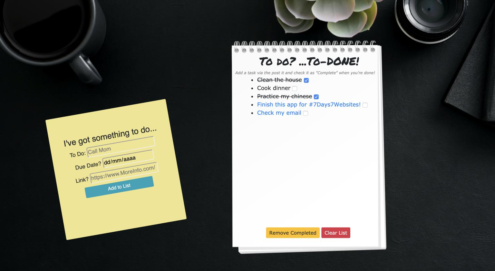

# To-DONE

## Project Description
A classic 'To-Do' task manager application where a user can keep track of and otherwise manage their various tasks through a fun personal-desk themed UI. (Tasks are input through a "post-it" note and tracked on a spiral notepad)
- Inspired from [florinpop17 / app-ideas / To-Do App](https://github.com/florinpop17/app-ideas/blob/master/Projects/2-Intermediate/To-Do-App.md)

## Dependencies
* [GA Browser Template](https://git.generalassemb.ly/ga-wdi-boston/browser-template) - webpack for `require` system, build pipeline, and development server.
  - includes [Bootstrap](https://getbootstrap.com/docs/4.5/getting-started/introduction/) and [Handlebars.js](https://handlebarsjs.com/guide/)
* [npm](https://www.npmjs.com/): `npm install`

## User Stories
As a user I want to...
* see an input field where I can type in a task
* submit the task and see it reflected in a list of to-dos
* mark a task as completed
* remove a task

## Future Goals
In future iterations of this project I would firstly like to add functionality to alert the user when a due-date for one of their tasks is approaching.

Additionally I would also like to greatly improve its mobile-responsiveness, and perhaps add extra attributes to the `todo` items (would need to brainstorm what else would be useful to the user).

Lastly I would like to de-bug the strange ordering of the localStorage index view (the to do list items don't load in order) and adjuset my form validation so it allows for closer due dates (currently not allowing less than one day out).
